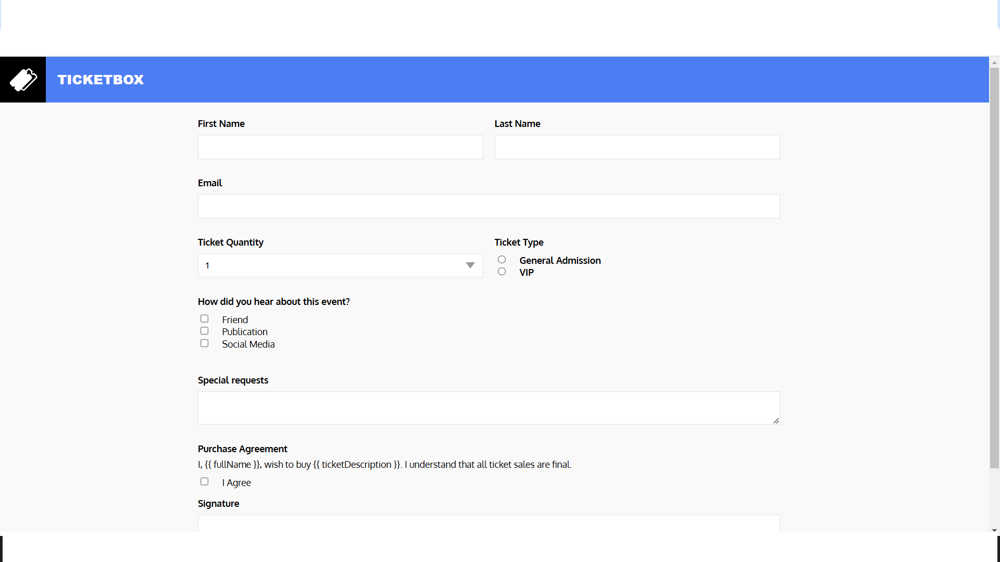

# E-ticketing



## Description
E-ticketing is a web application for purchasing event tickets. It allows users to fill out a form with their personal information, select ticket quantity and type, and agree to the purchase terms.

## Features
- User-friendly form for ticket purchase
- Input validation
- Responsive design
- Vue.js for reactive form handling

## Technologies Used
- HTML
- CSS
- Vue.js

## Setup
1. Clone the repository:
   ```sh
   git clone https://github.com/alyatalla/E-ticketing.git